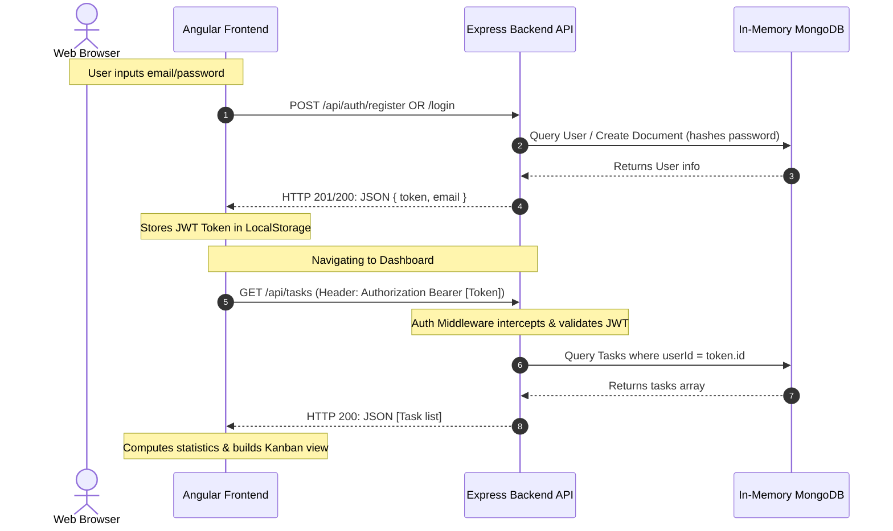
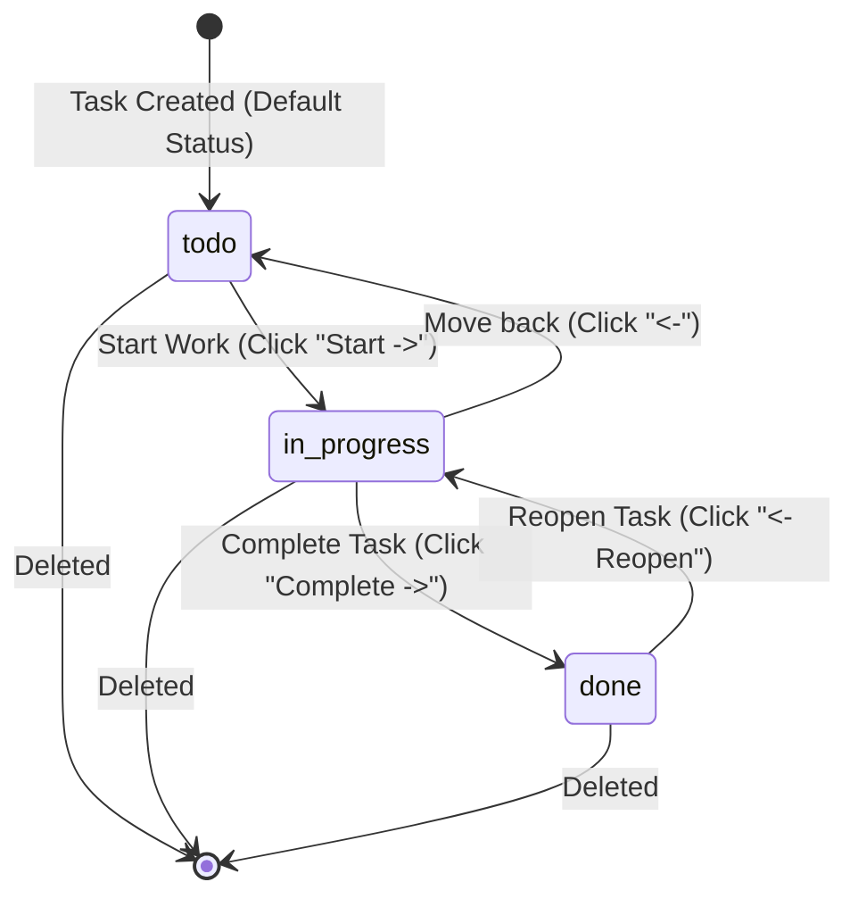

# Binaried Task Management Application

A full-stack, responsive Task Management application implementing a visual **Kanban Board** with automated statistics, search, and priority sorting. Built using **Angular** (v22 standalone) for the frontend, **Node.js + Express** for the API gateway, and **MongoDB** for data persistence.

To ensure immediate, out-of-the-box operation on any local system, the backend is configured to automatically download, configure, and boot an isolated **in-memory MongoDB database server** (`mongodb-memory-server`) as a fallback if no external instance is specified.

---

## 📂 Project Directory Structure

Below is the directory tree explaining the organization of the frontend and backend files:

```text
binared/
├── backend/
│   ├── config/
│   │   └── db.js            # DB connection & MongoDB Memory Server bootstrap
│   ├── middleware/
│   │   └── auth.js          # JWT Verification Middleware
│   ├── models/
│   │   ├── Task.js          # Mongoose Task Schema
│   │   └── User.js          # Mongoose User Schema
│   ├── routes/
│   │   ├── auth.js          # Auth API endpoints (Register/Login)
│   │   └── tasks.js         # Task CRUD API endpoints
│   ├── .env                 # Backend environment config
│   ├── package.json         # Node dependencies & start scripts
│   └── server.js            # Application entrypoint
├── frontend/
│   ├── src/
│   │   ├── app/
│   │   │   ├── components/
│   │   │   │   ├── dashboard/
│   │   │   │   │   ├── dashboard.ts    # Dashboard logic
│   │   │   │   │   ├── dashboard.html  # Dashboard UI layout
│   │   │   │   │   └── dashboard.css   # Glassmorphic CSS style
│   │   │   │   └── login/
│   │   │   │       ├── login.ts        # Login logic
│   │   │   │       ├── login.html      # Login UI layout
│   │   │   │       └── login.css       # Login CSS style
│   │   │   ├── pipes/
│   │   │   │   ├── filter-status.pipe.ts  # Filters tasks by Kanban column status
│   │   │   │   └── is-overdue.pipe.ts     # Computes overdue status against system clock
│   │   │   ├── services/
│   │   │   │   ├── api.service.ts   # Core Angular HTTP data service
│   │   │   │   └── auth.guard.ts    # Route guard to block unauthenticated guests
│   │   │   ├── app.config.ts        # Boot providers (HttpClient, Routers)
│   │   │   ├── app.routes.ts        # Lazy loaded router paths
│   │   │   ├── app.ts               # Core component class
│   │   │   └── app.html             # Core router-outlet mount
│   │   └── styles.css               # Global reset, fonts, and dark base styles
│   └── package.json                 # Angular dependencies & build configurations
└── README.md                        # Documentation
```

---

## 🔄 Core Application Workflows

### 1. Authentication & API Flow
The diagram below details the sequence of request-response operations when a user registers/logs in and requests task data:



### 2. Task Lifecycle on the Kanban Board
The state diagram below illustrates how tasks are created and transitioned between Kanban boards in the UI:



---

## 🌐 API Specification

All backend endpoints are prefixed with `/api`. Authenticated endpoints require the header `Authorization: Bearer <JWT_TOKEN>`.

| Method | Endpoint | Authentication | Request Body (JSON) | Query Parameters | Description |
| :--- | :--- | :--- | :--- | :--- | :--- |
| **POST** | `/auth/register` | Public | `{ "email": "...", "password": "..." }` | *None* | Registers a new user. Returns user details and a signed JWT. |
| **POST** | `/auth/login` | Public | `{ "email": "...", "password": "..." }` | *None* | Authenticates credentials. Returns user details and a signed JWT. |
| **GET** | `/tasks` | **JWT Token** | *None* | `status`, `priority`, `search` | Retrieves the list of tasks matching optional filter parameters. |
| **POST** | `/tasks` | **JWT Token** | `{ "title": "...", "description": "...", "status": "...", "priority": "...", "dueDate": "..." }` | *None* | Creates a new task document mapped to the authenticated user's ID. |
| **PUT** | `/tasks/:id` | **JWT Token** | `{ "title": "...", "status": "...", ... }` | *None* | Updates parameters of the task identified by ID (verifies ownership). |
| **DELETE** | `/tasks/:id` | **JWT Token** | *None* | *None* | Deletes the task document matching the provided ID (verifies ownership). |

---

## 🚀 Running the Project Locally

### 1. Start the Backend Server
```bash
cd backend
npm install
npm start
```
*When starting the backend, Mongoose connects to the in-memory database. If it is the first launch, Node will output download progress while fetching the pre-built MongoDB engine.*

**Successful Startup Log:**
```text
No MONGODB_URI found or set to memory. Starting MongoDB Memory Server...
MongoDB Memory Server started at: mongodb://127.0.0.1:52874/
MongoDB Connected: 127.0.0.1
Server running on port 5000
```

### 2. Start the Frontend Server
```bash
cd frontend
npm install
npm start
```
*The Angular development server compiles the CSS and TypeScript files, launching a local hot-reloading dev server.*

**Successful Startup Log:**
```text
Application bundle generation complete.
Watch mode enabled. Watching for file changes...
  ➜  Local:   http://localhost:4200/
```

Open your browser and navigate to **[http://localhost:4200](http://localhost:4200)** to register and run the task board app.

---

## 🛠️ Project Technical Evaluation

### 1. AI Tools Used
- **Gemini 3.5 Flash** (via the Antigravity AI Coding Assistant).

### 2. Where AI Helped
- **Scaffolding and Setup**: Generated folder structure templates for the backend server controllers, middlewares, routes, and Angular frontend standalone layout.
- **Glassmorphism CSS Theme**: Styled the visual elements of the application, including custom form animations, scrollbars, state colors, and progress indicators.
- **Kanban Column Filters**: Wrote base structures for filtering states, search variables, and computed lists.

### 3. What Was Implemented Yourself
- **Dynamic Database Driver**: Configured the server database startup helper to check if a local MongoDB connection string exists; if not, it automatically spins up `mongodb-memory-server` in-memory.
- **Auth Guard & Pipes**: Programmed the frontend route blocking logic using `authGuard` and custom pipes (`FilterStatusPipe` and `IsOverduePipe`) to keep components clean.
- **API CORS & JWT Middleware Integration**: Wired the token verification middleware, token signing helpers, and CORS headers to secure connection tunnels between frontend and backend.

### 4. Challenges Faced & Workarounds
- **No Local MongoDB/Docker**: Addressed by writing a self-contained local database connector.
- **Missing Git CLI on System**: Handled by manually managing structural milestones and keeping version records directly in the workspace docs.

### 5. Future Improvements (If Given More Time)
- **Drag-and-Drop Column Shifting**: Add `@angular/cdk/drag-drop` support to drag task cards between board columns natively.
- **Multi-Client Real-Time Synchronization**: Connect clients through WebSockets (`socket.io`) to update task lists simultaneously on multiple screens.
- **End-to-End Testing Suite**: Build integration tests using Cypress or Playwright for verification.

---

## 👤 Candidate Details

- **Name**: Chaitanya Jagan
- **Email**: chaitanyajagan2005@gmail.com
- **Phone**: +91 8919189194
- **LinkedIn**: [chaitanyajagan](https://www.linkedin.com/in/chaitanyajagan)
- **GitHub**: [Chaitanyajagan](https://github.com/Chaitanyajagan)
